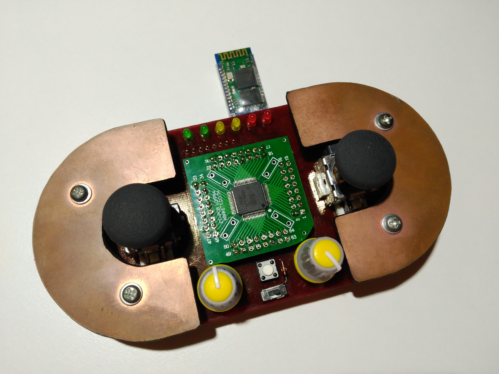

# Mando RC
Mando radiocontrol con bluetooth.

Este mando fue diseñado en un principio para el robot de sumo teledirigido, [Kassius](https://github.com/Resaj/rc-sumo-kassius), pero puede programarse para otro tipo de robots y aplicaciones.

El microcontrolador empleado es el LPC2138, soldado sobre una placa comercial. Esto da la posibilidad de poder cambiarlo y sustituirlo por otro microcontrolador.

Está compuesto por dos joystick, dos pulsadores frontales, dos potenciómetros y varios leds de señalización. Con una batería lipo 1S y conexión para bluetooth y un módulo RF-nano. Se programa con un FTDI externo a través del conector del bluetooth.

## Autor
[Rubén Espino San José](https://github.com/Resaj)

## License

Todos estos productos están liberados mediante [Creative Commons Attribution-ShareAlike 4.0 International License](http://creativecommons.org/licenses/by-sa/4.0/).  
_All these products are released under [Creative Commons Attribution-ShareAlike 4.0 International License](http://creativecommons.org/licenses/by-sa/4.0/)._
